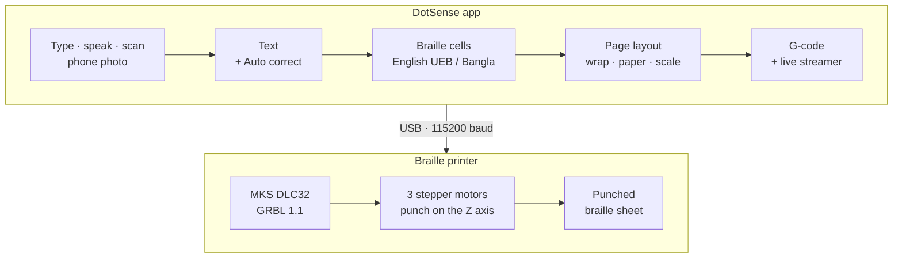

[README.md](https://github.com/user-attachments/files/32872168/README.md)
<div align="center">


# DotSense — 3D Braille Printer

**Type, speak or scan Bangla and English text, turn it into braille, and punch it on a low-cost CNC machine, dot by dot, live.**

[](https://www.electronjs.org)
[](https://nodejs.org)

[](https://github.com/gnea/grbl)

</div>

DotSense is a desktop app and a low-cost braille embosser. The app turns text into Grade-1 braille, lays it out on the page, writes the G-code and streams it over USB to a GRBL-controlled CNC machine, which punches every dot into the paper while the screen shows the progress. The machine is built from about 20,120 BDT (≈ US$164) of parts.

Made by **Team TactiCore** at United International University, Dhaka, as a CSE 4326 course project.

<p align="center">
  <picture>
    <source media="(prefers-color-scheme: dark)" srcset="docs/images/dotsense-printing-dark.png">
    
  </picture>
  <br>
  <sub>Printing on the built-in simulator: punched dots turn black and the current dot is highlighted.</sub>
</p>

<!-- Demo video: add the YouTube link here, for example  [▶ Watch the demo](https://youtu.be/...) -->

## Features

- **English and Bangla braille** – Grade-1 English with Unified English Braille (UEB) signs, checked against liblouis `en-ueb-g1`, and Bangla braille in the Bangladesh standard. Both can be mixed in one text.
- **Type, speak or scan** – offline voice typing in English and Bangla, and OCR for photos, scans and PDF files (Bangla, English, or both on one page).
- **Photo from phone** – scan a QR code, take a photo, and it arrives in DotSense over the machine's Wi-Fi (or any shared Wi-Fi) and is read with the same OCR.
- **Auto correct** – spelling, grammar, capital and punctuation mistakes are underlined as you type, in English and Bangla, with one-click fixes and Undo.
- **Automatic page layout** – text wraps into lines and pages by itself; 21 paper sizes plus a custom size; *Fit*, *Reduce* or *Custom* braille scaling (50–200 %). Every dot is checked against the margins before the machine moves.
- **Live printing** – each dot is shown as it is punched, with progress and time left. Pause, Stop, Soft Reset, and a countdown between sheets.
- **Invert print** – mirrored punching, so the raised dots read correctly on the back of the sheet. *Invert view* shows both sides live.
- **Machine setup** – a calibration guide, lockable machine values, jog and zero, and **Check**, which traces the margin line before anything is punched.
- **Simulator** – try the whole print flow without a machine.
- **Private and offline** – OCR, voice typing and Auto correct run on your computer. The voice models are downloaded once; after that, no internet is needed.
- **Files and looks** – save the G-code of a page, all pages as a ZIP, or a project; copy the page as Unicode braille for proofreading; light and dark mode.

## How it works



Every dot becomes four G-code moves: travel over the dot, punch down, lift to clearance, and a short dwell. This is the first dot of the letter H as DotSense writes it with the default settings:

```gcode
; ===== H =====
G0 X10 Y135
G1 Z-5 F1000
G0 Z5
G4 P0.2
```

The streamer counts characters so it never overflows GRBL's 127-byte receive buffer, asks for the machine status every 200 ms, and follows the progress from the line numbers GRBL reports.

## Hardware

DotSense drives a three-axis gantry built from 2020 V-slot aluminium profile, with three NEMA 17 stepper motors and an MKS DLC32 controller (ESP32) running GRBL 1.1. The punch rides on the Z axis. The board connects by USB, where it shows up as a CH340 serial port, and it also makes its own Wi-Fi network (`MKS_DLC`) that Photo from phone can use.

<details>
<summary><b>Bill of materials: 20,120 BDT (about US$164 at the September 2026 rate)</b></summary>

| Part | Qty | Cost (BDT) |
| --- | ---: | ---: |
| NEMA 17 stepper motor | 3 | 2,100 |
| 2020 V-slot aluminium profile, 1500 mm | | 3,500 |
| Stepper motor driver | 3 | 1,000 |
| POM wheels | 12 | 1,800 |
| MKS DLC32 32-bit controller board | 1 | 4,200 |
| Metal fabrication | | 2,500 |
| T-nuts | | 100 |
| Corner brackets | 4 | 400 |
| Screws and bolts | | 200 |
| Power supply | 1 | 1,200 |
| Printer parts | | 1,000 |
| Wires and connectors | | 300 |
| Z-axis / 3D-printed assembly (with LM8UU bearings) | | 1,200 |
| 625ZZ bearings (5 × 16 × 5 mm) | | 230 |
| GT2 timing belt, 6 mm | | 390 |
| **Total** | | **20,120** |

</details>

## Getting started

### Requirements

- [Node.js](https://nodejs.org) 22 or newer
- Windows, macOS or Linux
- To print: a GRBL 1.1 machine on USB. No machine yet? Use the simulator.

### Run from source

Download or clone this repository, open a terminal in the folder with `package.json`, and run:

```bash
npm install   # the first time, this also downloads the Electron runtime (about 100 MB)
npm start
```

### Try it without a machine

```bash
npm run simulator
```

This adds **Simulator (no machine)** to the port list, so you can run a whole print and try Pause, Stop and the countdown between sheets.

### Build an installer

```bash
npm run dist
```

This builds for the system you run it on, into `dist/`: a Windows installer (`.exe`), a macOS disk image (`.dmg`) or a Linux `.AppImage`.

### Run the tests

```bash
npm test
```

The unit tests cover braille translation (UEB cells compared with liblouis), Bangla braille, wrapping and pages, paper sizes and scaling, invert print, G-code, Auto correct, the GRBL streamer against a simulated GRBL (the buffer never overflows; pause, stop, alarms, unplugging), voice model unpacking, Wi-Fi status parsing and the phone link.

## Your first print

1. **Connect.** Plug in the machine. Open **Machine setup › Connection**, press ⟳, choose the port (`COM3` on Windows, `ttyUSB0` on Linux, `cu.usbserial…` on macOS) at 115200 baud and press **Connect**. Close Candle, UGS and other G-code senders first: only one program can use the port.
2. **Set zero.** Clamp the paper. In **Machine setup › Tool Box**, set **X/Y zero** at the paper's front-left corner and **Z zero** on the paper surface.
3. **Add text.** Type, speak or scan. In **Page**, switch on **Use paper size** and pick the sheet.
4. **Check.** Press **Check** in the Tool Box: the punch lifts 5 mm, traces the margin line and goes back to the start. The path must stay on the paper.
5. **Print.** Tick **Position and paper checked**, then press **Print page** or **Print all pages**.

> [!WARNING]
> Stay next to the machine and its power switch while it prints. **Stop** and **Soft Reset** are software stops, not an emergency stop. Keep your hands away from the punch, also while the countdown between sheets is running.

The full manual, with every panel, the braille rules, OCR, voice typing, Photo from phone and more troubleshooting, is in **[docs/USER-GUIDE.md](docs/USER-GUIDE.md)**.

## Project structure

| Path | What it does |
| --- | --- |
| `main.js`, `preload.js` | Electron main process (windows, files, OCR, serial port) and the safe bridge to the window |
| `renderer.js`, `index.html`, `styles.css`, `theme.js` | The main window; `theme.js` picks light or dark mode before the window is drawn |
| `core.js` | Braille translation (English and Bangla), wrapping, page layout, G-code and time estimate |
| `grbl.js` | GRBL streaming, machine status, live progress, pause and stop |
| `fake-grbl.js` | GRBL simulator for the tests and `npm run simulator` |
| `ocr-text.js` | OCR clean-up: second looks, junk removal, joined paragraphs, small repairs |
| `checker.js`, `spell-worker.js` | Auto correct: the rules, and the English dictionary check |
| `voice-worker.js`, `voice-models.js`, `capture-worklet.js` | Offline voice typing (English and Bangla) |
| `wifi.js` | The machine's Wi-Fi: status and one-click join (netsh, networksetup or nmcli) |
| `phone-server.js`, `phone-page.html` | Photo from phone: the local web server, QR codes and the phone's camera page |
| `invert.html`, `invert.js` | The mirrored machine side in its own window |
| `scripts/start.js` | `npm start`; on macOS it runs the app under the DotSense name and icon |
| `tests/` | Unit tests (`npm test`) |
| `build/` | App icons for the installers |
| `brand/` | Profile logos shown in About |
| `docs/` | User guide and screenshots |

## Troubleshooting

| Problem | What to do |
| --- | --- |
| *Port busy* or *Access denied* | Close Candle, UGS or the Arduino IDE. |
| No ports listed (Windows) | Install the CH340 USB driver for your board. |
| *Permission denied* (Linux) | Run `sudo usermod -a -G dialout $USER`, then log out and back in. |
| No reply from GRBL | Check the baud rate (115200 for GRBL 1.1) and the USB cable. |
| ALARM | Check the machine, then press **Unlock**. After a limit alarm, set zero again. |
| The phone cannot open the page | Allow DotSense in Windows Firewall (tick *Public networks* too) and put the phone and the computer on the same Wi-Fi. See [the user guide](docs/USER-GUIDE.md#machine-wifi-and-photo-from-phone). |

## Limitations

- English braille is Grade 1 (uncontracted), and capital letters are not marked.
- Characters without a braille sign yet (such as ₹, ৳ or emoji) are listed in a warning and punched as blank cells.
- Please have a braille reader check your first Bangla pages.

## Built with

- [Electron](https://www.electronjs.org) and [Node SerialPort](https://serialport.io)
- [tesseract.js](https://github.com/naptha/tesseract.js) with English and Bangla models, and [pdf.js](https://mozilla.github.io/pdf.js/), for OCR
- [sherpa-onnx](https://github.com/k2-fsa/sherpa-onnx) with Moonshine and Vosk models and Silero VAD, for voice typing
- [nspell](https://github.com/wooorm/nspell) with Hunspell dictionaries from [wooorm/dictionaries](https://github.com/wooorm/dictionaries), for spelling
- [qrcode-generator](https://github.com/kazuhikoarase/qrcode-generator), [JSZip](https://stuk.github.io/jszip/) and [electron-builder](https://www.electron.build)
- [liblouis](https://liblouis.io) tables as the reference for the UEB tests

## Team

**Team TactiCore (Group 03)** · Department of Computer Science and Engineering, United International University, Dhaka, Bangladesh

- **Tahasin Kabir Rubai** – team lead and app developer · [GitHub](https://github.com/TahasinKabir) · [LinkedIn](https://www.linkedin.com/in/tahasin-kabir)
- Ata Imam Hossain
- Md Nasir Khan Naim
- MD. Shahriar Parvez
- MD. Eahea

## License

No license has been added yet, so default copyright applies: © 2026 Tahasin Kabir Rubai. The open-source libraries and models listed above keep their own licenses.
